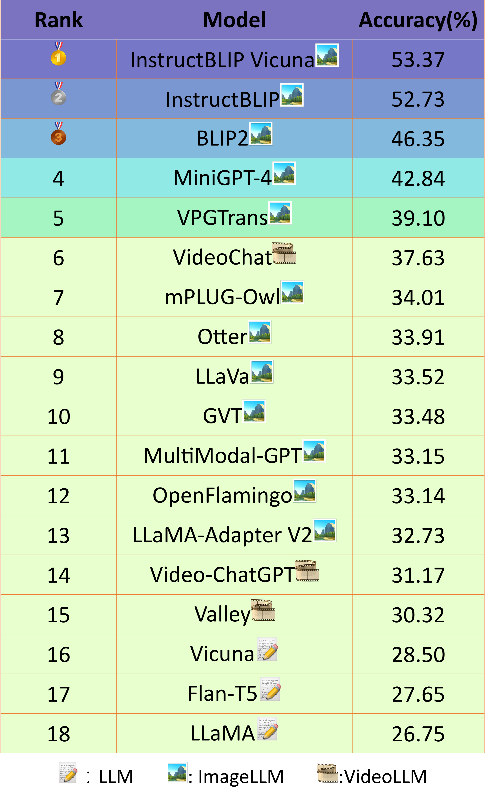

# SEED-Bench: Benchmarking Multimodal LLMs with Generative Comprehension
[Arxiv](https://arxiv.org/abs/2307.16125)

 
 
 SEED-Bench consists of 19K multiple-choice questions with accurate human annotations, covering 12 evaluation dimensions
including both the spatial and temporal understanding.
## News

**[2023.7.30]** SEED-Bench is released! Data and evaluation code is available now.

## Leaderboard

 

## Data Preparation

You can download the data of SEED-Bench released on HuggingFace repo [SEED-Bench](https://huggingface.co/datasets/AILab-CVC/SEED-Bench).
Please refer to [DATASET.md](DATASET.md) for image and video data preparation.

## Installation

Please refer to [INSTALL.md](INSTALL.md).

## Run Evaluation

The evaluation metric is provided in [eval.py](eval.py). We use [InstructBLIP](https://arxiv.org/abs/2305.06500) as example. To run the following evaluation code, please refer to [repo](https://github.com/salesforce/LAVIS) for the environment preparation.

```shell
python eval.py --model instruct_blip --anno_path SEED-Bench.json --output-dir results
```

If you want to evaluate your own models, please provide the interface like [instruct_blip_interface.py](instruct_blip_interface.py).

Note that to evaluate models with multiple-choice questions, we adopt the answer ranking strategy
following GPT-3. Specifically, for each choice of a question, we compute the likelihood 
that a model generates the content of this choice given the question. 
We select the choice with the highest likelihood as model's prediction. 
Our evaluation strategy does not rely on the instruction-following capabilities 
of models to output 'A' or 'B' or 'C' or 'D'.

## License
SEED-Bench is released under Apache License Version 2.0.

## Declaration
For the images of SEED-Bench, we use the data from Conceptual Captions Dataset (https://ai.google.com/research/ConceptualCaptions/)
following its license (https://github.com/google-research-datasets/conceptual-captions/blob/master/LICENSE).
Tencent does not hold the copyright for these images and the copyright belongs to the original owner of Conceptual Captions Dataset. 

For the videos of SEED-Bench, we use tha data from Something-Something v2 (https://developer.qualcomm.com/software/ai-datasets/something-something),
Epic-kitchen 100 (https://epic-kitchens.github.io/2023) and 
Breakfast (https://serre-lab.clps.brown.edu/resource/breakfast-actions-dataset/). We only provide the video name. Please download them in their official websites.
